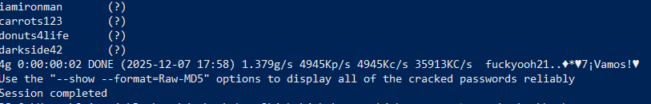

# Password Cracking – Phase 2

## Murretut salasanat

Käytin tehtävässä työkaluna: John the Ripper, käyttäen sanalistaa `rockyou.txt`. Nämä salasanat olivat aika helppoja murtaa, kunhan sai työkalut toimintaan.

| Salasanat |
|----------|
| iamironman |
| carrots123 |
| donuts4life |
| darkside42 |

## Screenshot murtamisesta

## Teoriakysymykset

- Dictionary attacks= kokeillaan valmiista sanalistasta löytyviä salasanoja, nopea tapa.
- Non-dictionary = kokeillaan mahdollisia merkkiyhdistelmiä, hitaampi mutta varmempi tapa.

- Hashien avulla hyökkääjä voi murtaa salasanat jopa offline-tilassa. Ja siten pääsee käsiksi käyttäjätileihin, kun salasana on murrettu.

- Pitkissä salasanoissa on hyötynä se, että niitä on vaikeampi murtaa. Mitä pidempi salasana on niin sitä vaikeampaa murtaminen on.

